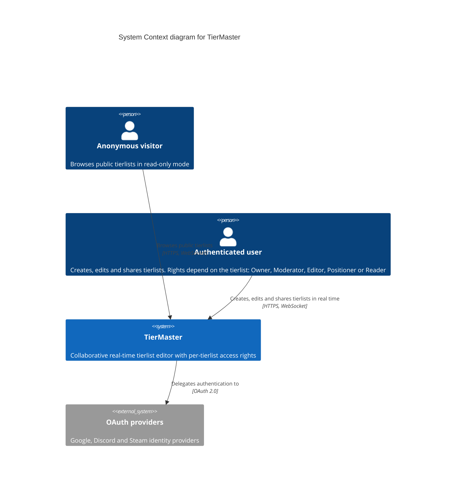

```mermaid
C4Context
    title System Context diagram for TierMaster

    Person(visitor, "Anonymous visitor", "Browses public tierlists in read-only mode")
    Person(user, "Authenticated user", "Creates, edits and shares tierlists. Rights depend on the tierlist: Owner, Moderator, Editor, Positioner or Reader")

    System(tierapp, "TierMaster", "Collaborative real-time tierlist editor with per-tierlist access rights")

    System_Ext(oauth, "OAuth providers", "Google, Discord and Steam identity providers")

    Rel(visitor, tierapp, "Browses public tierlists", "HTTPS, WebSocket")
    Rel(user, tierapp, "Creates, edits and shares tierlists in real time", "HTTPS, WebSocket")
    Rel(tierapp, oauth, "Delegates authentication to", "OAuth 2.0")

    UpdateLayoutConfig($c4ShapeInRow="2", $c4BoundaryInRow="1")
```

