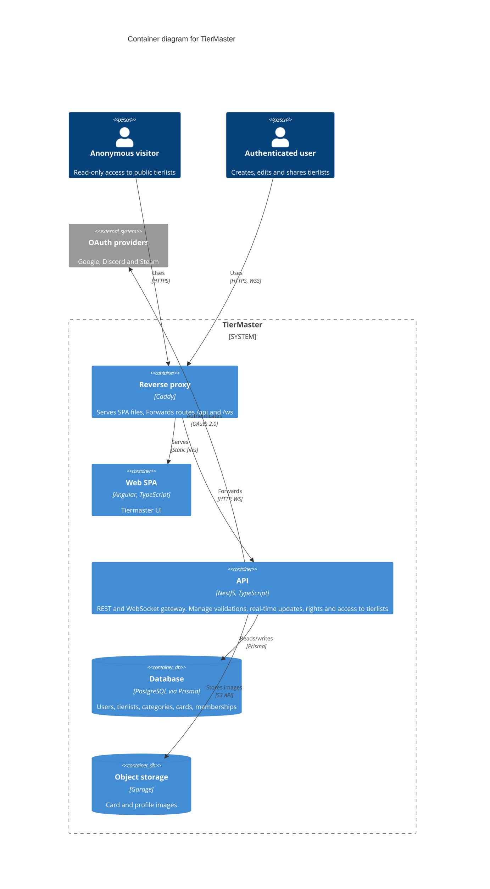

```mermaid
C4Container
    title Container diagram for TierMaster

    Person(visitor, "Anonymous visitor", "Read-only access to public tierlists")
    Person(user, "Authenticated user", "Creates, edits and shares tierlists")

    System_Boundary(tierapp, "TierMaster") {
        Container(proxy, "Reverse proxy", "Caddy", "Serves SPA files, Forwards routes /api and /ws")
        Container(spa, "Web SPA", "Angular, TypeScript", "Tiermaster UI")
        Container(api, "API", "NestJS, TypeScript", "REST and WebSocket gateway. Manage validations, real-time updates, rights and access to tierlists")
        ContainerDb(db, "Database", "PostgreSQL via Prisma", "Users, tierlists, categories, cards, memberships")
        ContainerDb(storage, "Object storage", "Garage", "Card and profile images")
    }

    System_Ext(oauth, "OAuth providers", "Google, Discord and Steam")

    Rel(visitor, proxy, "Uses", "HTTPS")
    Rel(user, proxy, "Uses", "HTTPS, WSS")
    Rel(proxy, spa, "Serves", "Static files")
    Rel(proxy, api, "Forwards", "HTTP, WS")
    Rel(api, db, "Reads/writes", "Prisma")
    Rel(api, storage, "Stores images", "S3 API")
    Rel(api, oauth, "Authenticates", "OAuth 2.0")
```

