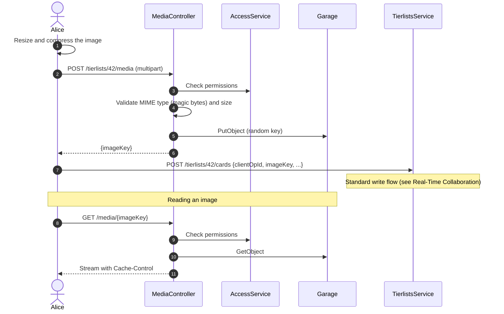

Images never travel through the WebSocket. The SPA resizes them client-side to keep uploads small, then sends them through the API, which validates and stores them in Garage.

```mermaid
sequenceDiagram
    autonumber
    actor A as Alice
    participant API as MediaController
    participant ACC as AccessService
    participant S3 as Garage
    participant TL as TierlistsService
 
    A->>A: Resize and compress the image
    A->>API: POST /tierlists/42/media (multipart)
    API->>ACC: Check permissions
    API->>API: Validate MIME type (magic bytes) and size
    API->>S3: PutObject (random key)
    API-->>A: {imageKey}
    A->>TL: POST /tierlists/42/cards {clientOpId, imageKey, ...}
    Note over TL: Standard write flow (see Real-Time Collaboration)
 
    Note over A,S3: Reading an image
    A->>API: GET /media/{imageKey}
    API->>ACC: Check permissions
    API->>S3: GetObject
    API-->>A: Stream with Cache-Control
```

