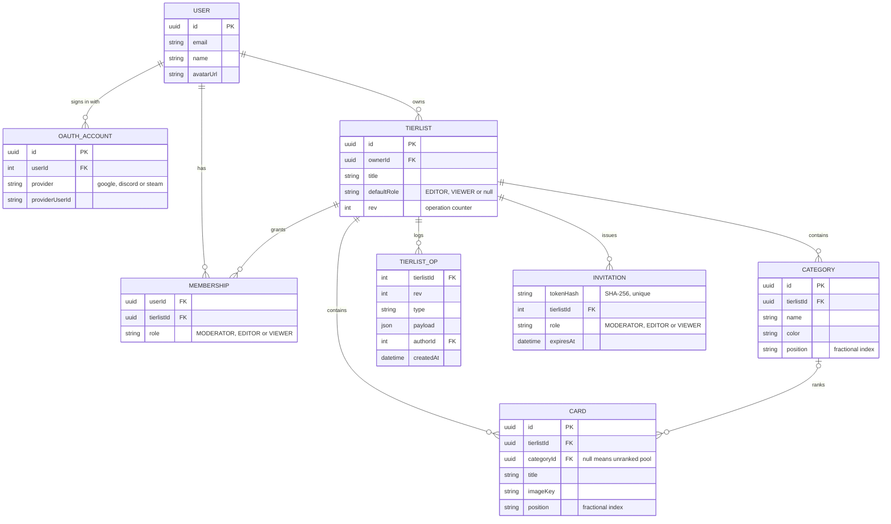

```mermaid
erDiagram
    USER ||--o{ OAUTH_ACCOUNT : "signs in with"
    USER ||--o{ TIERLIST : owns
    USER ||--o{ MEMBERSHIP : has
    TIERLIST ||--o{ MEMBERSHIP : grants
    TIERLIST ||--o{ CATEGORY : contains
    TIERLIST ||--o{ CARD : contains
    CATEGORY |o--o{ CARD : ranks
    TIERLIST ||--o{ TIERLIST_OP : logs
    TIERLIST ||--o{ INVITATION : issues
 
    USER {
        uuid id PK
        string email
        string name
        string avatarUrl
    }
    OAUTH_ACCOUNT {
        uuid id PK
        int userId FK
        string provider "google, discord or steam"
        string providerUserId
    }
    TIERLIST {
        uuid id PK
        uuid ownerId FK
        string title
        string defaultRole "EDITOR, VIEWER or null"
        int rev "operation counter"
    }
    MEMBERSHIP {
        uuid userId FK
        uuid tierlistId FK
        string role "MODERATOR, EDITOR or VIEWER"
    }
    CATEGORY {
        uuid id PK
        uuid tierlistId FK
        string name
        string color
        string position "fractional index"
    }
    CARD {
        uuid id PK
        uuid tierlistId FK
        uuid categoryId FK "null means unranked pool"
        string title
        string imageKey
        string position "fractional index"
    }
    TIERLIST_OP {
        int tierlistId FK
        int rev
        string type
        json payload
        int authorId FK
        datetime createdAt
    }
    INVITATION {
        string tokenHash "SHA-256, unique"
        int tierlistId FK
        string role "MODERATOR, EDITOR or VIEWER"
        datetime expiresAt
    }
```

